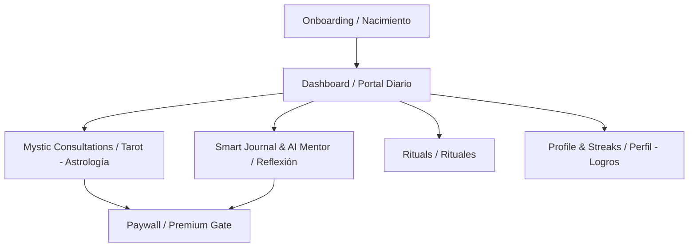
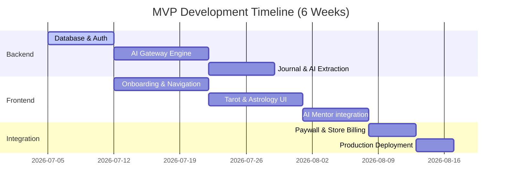

# ANTIGRAVITY MYSTIC PREMIUM (VIDENTE) - TECHNICAL & STRATEGIC BLUEPRINT
# ANTIGRAVITY MYSTIC PREMIUM (VIDENTE) - BLUEPRINT TÉCNICO Y ESTRATÉGICO

---

## TABLE OF CONTENTS / ÍNDICE

- [Phase 1: Product Strategy & UX/UI Framework](#phase-1-product-strategy--uxui-framework) / [Fase 1: Estrategia de Producto y Framework UX/UI](#fase-1-estrategia-de-producto-y-framework-uxui)
- [Phase 2: Architecture & System Design](#phase-2-architecture--system-design) / [Fase 2: Arquitectura y Diseño del Sistema](#fase-2-arquitectura-y-diseño-del-sistema)
- [Phase 3: API Specification](#phase-3-api-specification) / [Fase 3: Especificación de la API](#fase-3-especificación-de-la-api)
- [Phase 4: Execution Roadmap & Delivery Plan](#phase-4-execution-roadmap--delivery-plan) / [Fase 4: Hoja de Ruta de Ejecución y Plan de Entrega](#fase-4-hoja-de-ruta-de-ejecución-y-plan-de-entrega)

---

# PHASE 1: PRODUCT STRATEGY & UX/UI FRAMEWORK
# FASE 1: ESTRATEGIA DE PRODUCTO Y FRAMEWORK UX/UI

## 1.1 User Journeys & Wireframe Architecture / Viajes de Usuario y Arquitectura de Wireframes

### [EN] English Specification
Our premium UX design is modeled after Apple, Linear, and Notion. It utilizes a strict minimalist dark mode, using custom typography (Inter and Outfit) and custom color spaces (tailored HSL shades of deep slates, dark indigos, and warm violet glows) instead of generic colors. 

#### Core Navigation Structure (Tab-Based + Gestures)
- **Dashboard (Home)**: Daily personalized overview. Dynamic gradients indicating today's energy status (e.g., Violet glow for high intuition).
- **Consult (Tarot / Astrology / Numerology / Dream Interpreter)**: The mystic portal. Interactive card decks with smooth physics, drag-to-draw, and custom 3D shadow effects.
- **Reflection (AI Mentor / Smart Journal)**: A safe space. Clean text inputs, mood slider using tactile haptic feedback, and private trend analysis graphs.
- **Rituals**: Curated guide library organized in cards with progress indicators.
- **Profile / Streaks**: Gamified personal records, streaks visualizer, calendar tracker, and unlocked badges.



---

### [ES] Especificación en Español
Nuestro diseño de experiencia de usuario (UX) premium se basa en los estándares de Apple, Linear y Notion. Implementa un modo oscuro estrictamente minimalista, tipografía personalizada (Inter y Outfit) y paletas de colores HSL exclusivas (tonos pizarra profundos, índigos oscuros y resplandores violeta cálidos).

#### Estructura de Navegación Core (Pestañas + Gestos)
- **Dashboard (Inicio)**: Panel diario personalizado. Gradientes dinámicos que indican el estado energético de hoy (ej. resplandor violeta para intuición alta).
- **Consulta (Tarot / Astrología / Numerología / Sueños)**: El portal místico. Mazos de cartas interactivos con físicas suaves, arrastrar-para-sacar y efectos de sombras 3D.
- **Reflexión (Mentor IA / Diario Inteligente)**: Un espacio seguro. Entrada de texto limpia, control deslizante de estado de ánimo con respuesta háptica y gráficos de tendencias privados.
- **Rituales**: Biblioteca curada organizada en tarjetas con indicadores de progreso.
- **Perfil / Rachas**: Registro personal gamificado, visualizador de rachas, calendario de actividades e insignias desbloqueadas.

---

## 1.2 Gamification & Psychology Breakdown / Gamificación y Psicología del Comportamiento

### [EN] English Specification (Hook Model Application)
To maximize daily retention, we apply the Hook Model (Trigger -> Action -> Variable Reward -> Investment):
1. **Trigger**: 
   - *External*: Smart push notifications triggered by celestial transits (e.g., "Full Moon in Scorpio: time for your release journal entry") or personalized circadian habits.
   - *Internal*: Morning anxiety, curiosity about the day's outlook, or evening wind-down reflection.
2. **Action**:
   - High-reward, low-friction interactions: pulling one daily tarot card, registering mood with a single tap, logging a dream.
3. **Variable Reward**:
   - AI-driven, highly contextual interpretations that vary daily. A user never knows if today's card interpretation will yield a warning, a validation, or an action plan.
4. **Investment**:
   - Writing journal entries, building active streaks, and logging daily habits. This builds *stored value* within the app, raising switching costs.

#### Habit & Retention Loop Mechanics
- **Streak Protection (Llama/Moon Saver)**: Premium members get one automatic "streak freeze" per month. Free users can purchase or earn them.
- **Activity Calendar**: Visual dot grids (like GitHub contributions) mapped to emotional and spiritual activities.

---

### [ES] Especificación en Español (Modelo Hook)
Para maximizar la retención diaria, aplicamos el Modelo Hook (Disparador -> Acción -> Recompensa Variable -> Inversión):
1. **Disparador (Trigger)**:
   - *Externo*: Notificaciones push inteligentes basadas en tránsitos celestes (ej. "Luna Llena en Escorpio: momento de escribir en tu diario de liberación") o hábitos del usuario.
   - *Interno*: Ansiedad matutina, curiosidad sobre las energías del día o reflexión antes de dormir.
2. **Acción**:
   - Interacciones de alta recompensa y baja fricción: sacar una carta de tarot diaria, registrar el humor con un toque, registrar un sueño.
3. **Recompensa Variable**:
   - Interpretaciones basadas en IA altamente contextualizadas. El usuario no sabe si la interpretación de hoy será una advertencia, una validación o un plan de acción.
4. **Inversión**:
   - Redacción de entradas en el diario, acumulación de rachas y registro de hábitos. Esto crea *valor almacenado*, aumentando el costo de salida.

#### Mecánicas de Habito y Retención
- **Protector de Racha**: Los miembros Premium reciben un "streak freeze" automático al mes. Los usuarios gratuitos pueden ganarlos o comprarlos.
- **Calendario de Actividad**: Cuadrículas visuales (estilo contribuciones de GitHub) que representan actividades emocionales y espirituales.

---

## 1.3 Monetization Strategy / Estrategia de Monetización

### [EN] English Specification
We leverage a **Freemium** model with strategically placed value gates:
- **Free Tier**: Single Tarot pull per day, basic daily horoscope, manual mood log, 1 AI Dream Interpretation per week.
- **Premium Tier (Subscription: $9.99/mo, $59.99/yr)**: 
  - Complete Astrological Birth Chart analysis.
  - Multi-card Tarot spreads (3-Card, Celtic Cross).
  - Unlimited AI Dream Interpreter & conversational AI Mentor.
  - AI Mood & Trend Pattern detection over time.
  - Streak protection, premium rituals, and priority server routing.

#### Value Gating Implementation Logic
We isolate paywall triggers at the domain level. When a premium feature is requested, the client queries local state. If expired, it triggers a bottom-sheet paywall utilizing clean Notion-style typography, transparent benefits, and one-tap checkout.

---

### [ES] Especificación en Español
Implementamos un modelo **Freemium** con puertas de valor ubicadas estratégicamente:
- **Nivel Gratuito**: 1 carta de tarot al día, horóscopo diario básico, registro de humor manual, 1 interpretación de sueños semanal.
- **Nivel Premium (Suscripción: $9.99/mes, $59.99/año)**:
  - Análisis completo de Carta Astral.
  - Tiradas de tarot complejas (3 cartas, Cruz Celta).
  - Intérprete de Sueños y Mentor Conversacional IA ilimitados.
  - Detección de patrones y tendencias emocionales por IA.
  - Protector de racha, rituales premium y enrutamiento de servidor prioritario.

#### Lógica de Restricción de Funciones
Aislamos las restricciones a nivel de dominio. Si se requiere una función premium, la app cliente verifica el estado local. Si está inactivo, despliega un paywall elegante estilo Notion con beneficios claros y pago en un toque.

---

## 1.4 Trade-offs & Justification / Compromisos y Justificación

### [EN] English
- **Alternative Considered**: Core ad-supported model.
- **Why Rejected**: Ads ruin the minimalist, premium, therapeutic atmosphere (Notion/Apple feel). It dilutes user trust in a product dealing with deep reflection and mental wellness. A subscription-based approach aligns our incentives directly with user value and privacy.
- **Alternative Considered**: Custom proprietary payment gateway.
- **Why Rejected**: Using Google Play Billing and App Store In-App Purchases is mandatory for digital content on mobile platforms. Attempting bypasses results in store bans. We abstract payment gateways behind a clean repository pattern to swap to Stripe/RevenueCat easily for multi-platform readiness.

### [ES] Español
- **Alternativa Considerada**: Modelo monetizado por anuncios.
- **Por qué se rechazó**: Los anuncios arruinan la atmósfera minimalista, premium y terapéutica. Reduce la confianza en un producto enfocado en la salud mental y la reflexión. Una suscripción alinea nuestros incentivos con el valor real y la privacidad.
- **Alternativa Considerada**: Pasarela de pago propia/personalizada.
- **Por qué se rechazó**: Es obligatorio usar Google Play Billing e In-App Purchases de Apple para bienes digitales en móviles. Abstrayendo la lógica con un patrón repositorio permitimos migrar a Stripe o RevenueCat con facilidad en el futuro.

---

# PHASE 2: ARCHITECTURE & SYSTEM DESIGN
# FASE 2: ARQUITECTURA Y DISEÑO DEL SISTEMA

## 2.1 Global System Architecture / Diagrama de Arquitectura Global

```mermaid
graph TB
    subgraph Client Layer (Flutter)
        A[Flutter UI - Material 3] --> B[Riverpod State Management]
        B --> C[Clean Architecture Repositories]
    end
    
    subgraph API Gateway / Routing
        C --> D[Nginx SSL / Reverse Proxy]
    end

    subgraph Backend Layer (NestJS)
        D --> E[NestJS HTTP Controllers]
        D --> F[NestJS WebSocket Gateway]
        E --> G[Authentication Service]
        E --> H[Mystic Core Module]
        E --> I[AI Gateway Module]
        F --> J[AI Mentor Live Session]
    end

    subgraph Cache & Storage
        E --> K[Redis Cache & Rate Limiting]
        E --> L[PostgreSQL Database]
        I --> M[External LLMs: Gemini / OpenAI / Claude]
    end
```

---

## 2.2 AI Gateway Specification / Especificación del AI Gateway

### [EN] English Specification
The AI Gateway acts as a provider-agnostic abstraction layer. Core business logic never interacts with raw OpenAI or Gemini APIs directly.

#### Routing & Failover Protocol
Requests execute with fallback routing:
1. **Primary**: Google Gemini 1.5 Flash (Optimized for speed, high-volume token processing, and cost efficiency).
2. **First Fallback**: OpenAI GPT-4o-mini (Reliable backup, fast, standard fallback).
3. **Second Fallback**: Anthropic Claude 3.5 Sonnet (For deep conversational reflective sessions in AI Mentor if primary fails).
4. **Third Fallback**: Mistral (Self-hosted alternative or API backup).

#### Cost Tracking & Token Logging
Every LLM response is processed asynchronously via NestJS events to log usage:
- Calculated input/output tokens saved to `ai_gateway_logs` table.
- Real-time costing applied using configured provider rates.

#### Rate Limiting & Prompt Caching
- **Redis Token Bucket**: Limits users to a configured requests-per-minute threshold based on subscription tier (e.g., Free = 2 req/min; Premium = 30 req/min).
- **Prompt Caching**: Daily horoscopes and transit predictions are hashed. If a request matches the hash of a pre-generated reading for a specific zodiac sign on a specific date, the cached response is served from Redis instead of querying the LLM, reducing latency and cost.

#### JSON Schema Enforcement (Zod Validation)
The gateway mandates structured output modes. For critical tasks (e.g., Birth Chart generation and Tarot interpretations), it sends a JSON schema. The incoming payload is validated against a strict **Zod** schema. If validation fails, the gateway automatically retries once with a correction prompt.

---

### [ES] Especificación en Español
El AI Gateway actúa como una capa de abstracción independiente del proveedor. La lógica de negocio nunca interactúa directamente con las API nativas de OpenAI o Gemini.

#### Protocolo de Enrutamiento y Failover
Las solicitudes se ejecutan con la siguiente secuencia de fallos:
1. **Primario**: Google Gemini 1.5 Flash (Optimizado para velocidad, procesamiento masivo y costos).
2. **Respaldo 1**: OpenAI GPT-4o-mini (Seguro, rápido y estándar).
3. **Respaldo 2**: Anthropic Claude 3.5 Sonnet (Para conversaciones reflexivas y profundas del Mentor IA).
4. **Respaldo 3**: Mistral (Alternativa self-hosted o de respaldo externo).

#### Control de Costos y Registro de Tokens
Cada respuesta se procesa de forma asíncrona mediante eventos de NestJS para registrar el uso:
- Los tokens de entrada y salida se almacenan en la tabla `ai_gateway_logs`.
- Se aplica el costo en tiempo real basado en las tarifas de los proveedores.

#### Límite de Tasa y Caché de Prompts
- **Redis Token Bucket**: Limita las solicitudes por minuto por nivel de usuario (Gratuito = 2 req/min; Premium = 30 req/min).
- **Prompt Caching**: Los horóscopos diarios y predicciones de tránsito se hashean. Si coincide con una lectura pregenerada, se sirve desde Redis.

#### Validación y Control de Esquemas JSON (Zod)
El gateway obliga a usar modos de salida estructurada. Para tareas críticas (Carta Astral, Tarot), envía un esquema JSON y valida el payload recibido contra un esquema de **Zod**. Si falla, reintenta automáticamente con un prompt de corrección.

---

## 2.3 Database Schema / Esquema de Base de Datos (DDL)

```sql
-- Enable UUID extension / Habilitar extensión UUID
CREATE EXTENSION IF NOT EXISTS "uuid-ossp";

-- 1. USERS TABLE / TABLA DE USUARIOS
CREATE TABLE users (
    id UUID PRIMARY KEY DEFAULT uuid_generate_v4(),
    email VARCHAR(255) UNIQUE NOT NULL,
    password_hash VARCHAR(255) NOT NULL,
    full_name VARCHAR(100),
    birth_date DATE,
    birth_time TIME,
    birth_place VARCHAR(255),
    created_at TIMESTAMP WITH TIME ZONE DEFAULT CURRENT_TIMESTAMP,
    updated_at TIMESTAMP WITH TIME ZONE DEFAULT CURRENT_TIMESTAMP
);

-- Indexes for quick lookups / Índices para búsquedas rápidas
CREATE INDEX idx_users_email ON users(email);

-- 2. SUBSCRIPTIONS TABLE / TABLA DE SUSCRIPCIONES
CREATE TYPE subscription_status AS ENUM ('active', 'expired', 'canceled');
CREATE TYPE payment_provider AS ENUM ('google_play', 'stripe', 'revenuecat');

CREATE TABLE subscriptions (
    id UUID PRIMARY KEY DEFAULT uuid_generate_v4(),
    user_id UUID REFERENCES users(id) ON DELETE CASCADE,
    provider payment_provider NOT NULL,
    transaction_id VARCHAR(255) NOT NULL,
    status subscription_status NOT NULL DEFAULT 'active',
    plan_id VARCHAR(50) NOT NULL,
    expires_at TIMESTAMP WITH TIME ZONE NOT NULL,
    created_at TIMESTAMP WITH TIME ZONE DEFAULT CURRENT_TIMESTAMP,
    updated_at TIMESTAMP WITH TIME ZONE DEFAULT CURRENT_TIMESTAMP
);

CREATE INDEX idx_subscriptions_user_id ON subscriptions(user_id);
CREATE INDEX idx_subscriptions_expires_at ON subscriptions(expires_at);

-- 3. AI GATEWAY LOGS TABLE / TABLA DE LOGS DEL AI GATEWAY
CREATE TABLE ai_gateway_logs (
    id UUID PRIMARY KEY DEFAULT uuid_generate_v4(),
    user_id UUID REFERENCES users(id) ON DELETE SET NULL,
    provider VARCHAR(50) NOT NULL,
    model VARCHAR(50) NOT NULL,
    prompt_tokens INT NOT NULL,
    completion_tokens INT NOT NULL,
    estimated_cost NUMERIC(10, 6) NOT NULL,
    feature_tag VARCHAR(50) NOT NULL,
    created_at TIMESTAMP WITH TIME ZONE DEFAULT CURRENT_TIMESTAMP
);

CREATE INDEX idx_ai_gateway_logs_user_id ON ai_gateway_logs(user_id);
CREATE INDEX idx_ai_gateway_logs_created_at ON ai_gateway_logs(created_at);

-- 4. SMART JOURNALS TABLE / TABLA DE DIARIOS INTELIGENTES
CREATE TYPE journal_type AS ENUM ('dream', 'mood', 'gratitude');

CREATE TABLE journals (
    id UUID PRIMARY KEY DEFAULT uuid_generate_v4(),
    user_id UUID REFERENCES users(id) ON DELETE CASCADE,
    entry_type journal_type NOT NULL,
    mood_rating INT CHECK (mood_rating >= 1 AND mood_rating <= 10),
    content TEXT, -- Encrypted locally or in transit / Encriptado en tránsito/localmente
    encrypted_content TEXT, -- Raw encrypted data if applicable / Datos encriptados
    ai_analysis JSONB, -- AI-extracted trends, tags, and sentiments / Tendencias e IA
    created_at TIMESTAMP WITH TIME ZONE DEFAULT CURRENT_TIMESTAMP,
    updated_at TIMESTAMP WITH TIME ZONE DEFAULT CURRENT_TIMESTAMP
);

CREATE INDEX idx_journals_user_id_created_at ON journals(user_id, created_at DESC);

-- 5. GAMIFICATION STATES TABLE / TABLA DE ESTADOS DE GAMIFICACIÓN
CREATE TABLE gamification_states (
    id UUID PRIMARY KEY DEFAULT uuid_generate_v4(),
    user_id UUID REFERENCES users(id) ON DELETE CASCADE UNIQUE,
    streak_days INT DEFAULT 0,
    last_activity_at DATE,
    total_points INT DEFAULT 0,
    level INT DEFAULT 1,
    unlocked_badges JSONB DEFAULT '[]'::jsonb,
    created_at TIMESTAMP WITH TIME ZONE DEFAULT CURRENT_TIMESTAMP,
    updated_at TIMESTAMP WITH TIME ZONE DEFAULT CURRENT_TIMESTAMP
);

CREATE INDEX idx_gamification_user_streak ON gamification_states(user_id, streak_days);
```

---

## 2.4 Trade-offs & Justification / Compromisos y Justificación

### [EN] English
- **Alternative Considered**: MongoDB or DynamoDB for Journals & AI Logs.
- **Why Rejected**: Financial data (subscriptions) and journal relation integrity demand ACID properties. PostgreSQL provides the stability of SQL with JSONB support, allowing document-style storage for complex LLM outputs (`ai_analysis` and `unlocked_badges`) alongside strict relational enforcement.
- **Alternative Considered**: Local Flutter SQLite for Journal storage.
- **Why Rejected**: SQLite is good for offline, but users lose journals when switching devices. We implement a hybrid model: local caching on Flutter using Hive for performance and encrypted synchronization with the PostgreSQL database.

### [ES] Español
- **Alternativa Considerada**: MongoDB o DynamoDB para los Diarios e Historial de IA.
- **Por qué se rechazó**: Los datos de pago (suscripciones) y la integridad de las relaciones de diarios exigen propiedades ACID. PostgreSQL ofrece la estabilidad de SQL clásica combinada con soporte JSONB, permitiendo guardar salidas complejas de LLM (`ai_analysis` y `unlocked_badges`) junto con validación relacional estricta.
- **Alternativa Considerada**: Almacenamiento local SQLite puro en Flutter.
- **Por qué se rechazó**: Si el usuario cambia de dispositivo pierde sus registros. Implementamos un modelo híbrido: caché local de alto rendimiento con Hive y sincronización cifrada con PostgreSQL.

---

# PHASE 3: API SPECIFICATION
# FASE 3: ESPECIFICACIÓN DE LA API

All endpoints require standard `Authorization: Bearer <JWT_TOKEN>` headers except public authentication routes.

---

## 3.1 REST API Specification (OpenAPI / Swagger Format)

### 3.1.1 Authentication Module / Módulo de Autenticación
#### `POST /api/v1/auth/register`
- **Description**: Registers a new user.
- **Request Body**:
```json
{
  "email": "user@example.com",
  "password": "SecurePassword123!",
  "fullName": "Astrid Vance",
  "birthDate": "1994-08-15",
  "birthTime": "14:35:00",
  "birthPlace": "Madrid, Spain"
}
```
- **Response (201 Created)**:
```json
{
  "userId": "d7b42fa0-bc90-482a-a92e-5034639908cf",
  "accessToken": "eyJhbGciOi...",
  "refreshToken": "df812ca4..."
}
```

#### `POST /api/v1/auth/login`
- **Description**: Login with email and password.
- **Response (200 OK)**: Returns new JWT accessToken and secure refreshToken.

---

### 3.1.2 Mystic Core Module (AI Consultation) / Consultas de IA
#### `POST /api/v1/mystic/tarot`
- **Description**: Pull cards and generate interpretation.
- **Request Body**:
```json
{
  "spreadType": "three_card", 
  "drawnCards": [1, 22, 15] 
}
```
- **Response (200 OK - Standard JSON Enforcement)**:
```json
{
  "interpretation": {
    "summary": "Un despertar a través de la tormenta / Awakening through the storm.",
    "cards": [
      { "id": 1, "name": "The Magician", "position": "past", "meaning": "Harnessing initial power." },
      { "id": 22, "name": "The Fool", "position": "present", "meaning": "Taking a leap of faith." },
      { "id": 15, "name": "The Devil", "position": "future", "meaning": "Confronting internal attachments." }
    ],
    "guidance": "Focus on clarity and let go of self-imposed chains."
  }
}
```

---

### 3.1.3 Smart Journal Module / Módulo de Diario Inteligente
#### `POST /api/v1/journal`
- **Description**: Creates an entry and triggers asynchronous AI mood & dream extraction.
- **Request Body**:
```json
{
  "entryType": "dream",
  "moodRating": 8,
  "content": "I was flying over a violet ocean while holding an hourglass."
}
```
- **Response (201 Created)**:
```json
{
  "entryId": "fc1a329e-c8aa-43d9-a9a3-5c8e3290efba",
  "analysis": {
    "tags": ["freedom", "control", "time"],
    "archetypes": ["The Wanderer"],
    "sentiment": "positive",
    "emotional_summary": "Quiet confidence about personal time management."
  }
}
```

---

### 3.1.4 Subscription & Payment Verification / Suscripciones y Pagos
#### `POST /api/v1/monetization/verify-receipt`
- **Description**: Validates Google Play Billing receipt or webhook event.
- **Request Body**:
```json
{
  "provider": "google_play",
  "purchaseToken": "gplay_token_xyz12345",
  "productId": "premium_monthly_01"
}
```
- **Response (200 OK)**:
```json
{
  "isPremium": true,
  "expiresAt": "2026-08-02T12:00:00Z",
  "status": "active"
}
```

---

## 3.2 WebSocket Specifications / Especificaciones de WebSockets

Used for low-latency streaming interactions in **AI Mentor** conversational session.

- **Gateway URI**: `wss://api.mysticpremium.com/v1/mentor`
- **Event: `mentor:join_session` (Client -> Server)**:
  - Establishes session state, passing authorization headers.
- **Event: `mentor:message` (Client -> Server)**:
```json
{
  "text": "Help me understand why I feel anxious during mercury retrograde."
}
```
- **Event: `mentor:chunk` (Server -> Client)**:
  - Streams chunks of token responses back to the client in real-time.
- **Event: `mentor:complete` (Server -> Client)**:
  - Notifies stream termination, sending final token calculations.

---

## 3.3 Trade-offs & Justification / Compromisos y Justificación

### [EN] English
- **Alternative Considered**: GraphQL for all operations.
- **Why Rejected**: GraphQL introduces schema complexity and makes HTTP-level caching (via Nginx/Redis) harder to configure. For a high-load, resource-constrained Hostinger VPS startup, REST handles structured caching and rate limiting with significantly lower memory footprint.
- **Alternative Considered**: Standard HTTP Polling for AI Mentor.
- **Why Rejected**: Polling makes conversational interactions feel laggy. WebSockets provide the sub-second responsiveness needed for premium streaming text output, mimicking ChatGPT/Claude typing interactions.

### [ES] Español
- **Alternativa Considerada**: GraphQL para todo.
- **Por qué se rechazó**: GraphQL añade complejidad de esquemas y dificulta la configuración de almacenamiento en caché HTTP (Nginx/Redis). Para un VPS de Hostinger con recursos limitados, REST maneja la caché estructurada con un consumo de memoria mucho menor.
- **Alternativa Considerada**: Polling HTTP estándar para el Mentor IA.
- **Por qué se rechazó**: El polling genera latencia incómoda. WebSockets proporciona la interactividad en tiempo real (efecto de escritura progresiva) requerida en experiencias conversacionales premium.

---

# PHASE 4: EXECUTION ROADMAP & DELIVERY PLAN
# FASE 4: HOJA DE RUTA DE EJECUCIÓN Y PLAN DE ENTREGA

## 4.1 User Stories & Core Use Cases / Historias de Usuario



1. **Daily Reflection & Actions**:
   - *US1*: As a user, I want to pull a daily tarot card so that I can reflect on a symbolic theme for the day.
   - *US2*: As a user, I want to write a dream journal entry so that I can keep track of my dream patterns and receive AI analysis.
2. **Habit Retention & Gamification**:
   - *US3*: As a user, I want to see my daily reflection streak increase so that I feel motivated to write in my journal daily.
3. **Monetization & Conversion**:
   - *US4*: As a free user, I want to buy a premium subscription via Google Play Billing so that I can unlock advanced spreads and unlimited dream interpretations.

---

## 4.2 Testing Strategy / Estrategia de Pruebas

We enforce a rigorous test hierarchy to guarantee absolute stability.

### 4.2.1 Core Test Suite
- **Unit Testing**: 
  - *Flutter*: Riverpod state testing using mocks.
  - *NestJS*: Isolation tests for calculation algorithms (e.g., Numerology math logic) using Jest.
- **Integration Testing**: 
  - API endpoint validation mocking the DB layer.
- **E2E Testing**:
  - Flutter Driver tests verifying the local flow: Onboarding -> Tarot Pull -> Paywall popup.

### 4.2.2 Prompt-Regression Testing
To ensure LLM responses do not degrade when modifying prompts, we run a custom CI/CD script:
- We maintain a suite of 20 test inputs (e.g., specific dreams, birth dates).
- We run the test cases through a staging environment and validate that the output contains:
  1. Valid JSON format.
  2. The correct Zod schemas.
  3. No prohibited text (medical, psychological, or absolute predictive claims).
  4. Positive sentiment tone.

---

## 4.3 Phased Deployment Plan / Plan de Despliegue por Fases

### Phase 1: MVP Setup & VPS Deployment (Weeks 1-4)
- **Infrastructure**: Single VPS (Hostinger), Docker-Compose setup:
  - 1 Container for NestJS.
  - 1 Container for PostgreSQL.
  - 1 Container for Redis.
  - Nginx handling SSL termination (Let's Encrypt).
- **Core Features**: Register, local birth chart generation, 1-card Tarot, Basic Journal.

### Phase 2: Beta Program & Optimization (Weeks 5-6)
- **Actions**: Deploy to 100 beta testers via Google Play Console Internal Testing and iOS TestFlight.
- **Metrics Tracked**: Crash logs, D1 retention rate, API gateway latency, database index utilization.

### Phase 3: Production Rollout & Scaling Vector (Beyond Week 6)
- **Scale Plan**: Migrate PostgreSQL to managed AWS RDS / Supabase when traffic exceeds 10k Daily Active Users (DAU).
- **CDN**: Cache static assets (tarot images, background audio, visual assets) on Cloudflare R2 to limit VPS network load.

---

## 4.4 Trade-offs & Justification / Compromisos y Justificación

### [EN] English
- **Alternative Considered**: Serverless deployment (AWS Lambda + DynamoDB).
- **Why Rejected**: Lambda runs can be expensive under continuous WebSocket connections (required for AI Mentor streaming). Dockerized NestJS on a fixed-cost Hostinger VPS provides predictable costs, ease of setup, and handles up to 5,000 active concurrent connections with Nginx and Redis pooling.
- **Alternative Considered**: Deploying multiple microservices.
- **Why Rejected**: Microservices introduce overhead in telemetry, communication, and resource usage. A clean modular monolith in NestJS is highly maintainable, compiles into a single service, and can be split into microservices later if scaling limits are reached.

### [ES] Español
- **Alternativa Considerada**: Despliegue Serverless (AWS Lambda + DynamoDB).
- **Por qué se rechazó**: Lambda puede ser muy costoso debido al flujo continuo de WebSockets (requerido por el Mentor IA). NestJS en Docker sobre un VPS Hostinger con costo fijo proporciona previsibilidad económica y soporta hasta 5,000 conexiones simultáneas usando Nginx y Redis.
- **Alternativa Considerada**: Despliegue estructurado en microservicios desde el inicio.
- **Por qué se rechazó**: Los microservicios aumentan la complejidad operativa y consumo de recursos. Un monolito modular limpio en NestJS es altamente mantenible, se compila en un solo contenedor y permite separación futura si la escala lo requiere.
